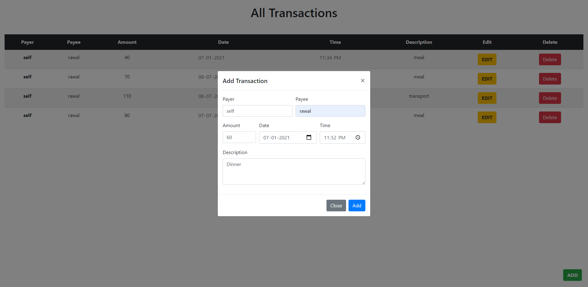
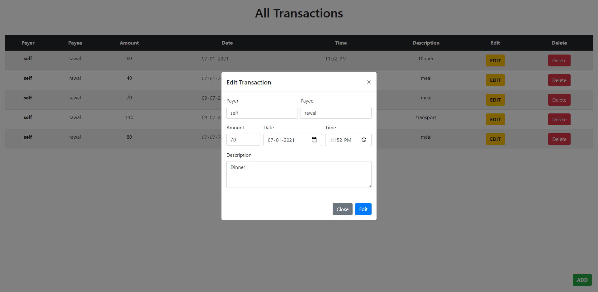
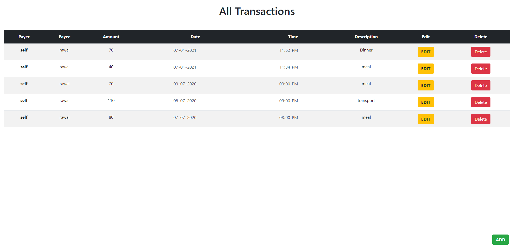

# Budget Management WebApp.

This is a Budget Management WebApp. This can do all the CRUD operation.

## Tech Stack

FrontEnd: React, Bootstrap. 
Backend: NodeJs, ExpressJs. 
Database: SQLite.

Backend for this WebApp is here: [Backend Server](https://github.com/Ikramul35/Budget-management-server)

# Images
Home Screen

Adding Screen

Added Screen

Editing Screen

Edited Screen

Deleted Screen

